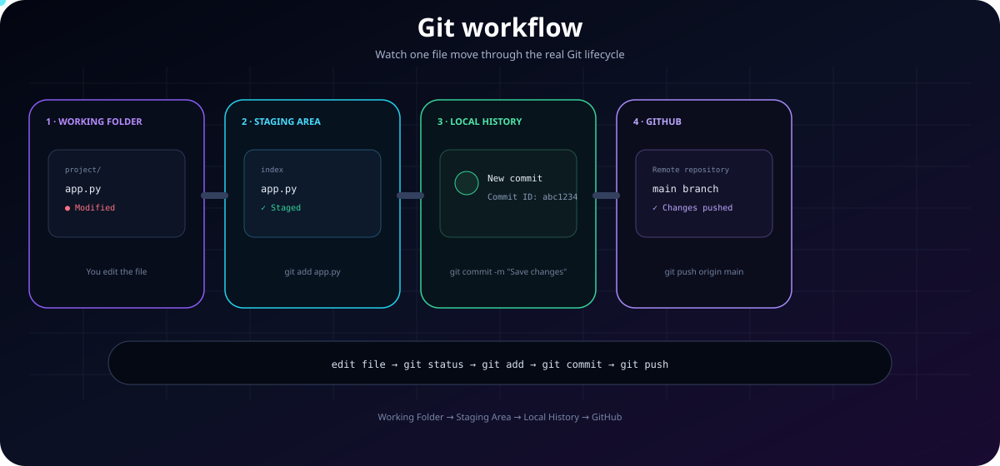
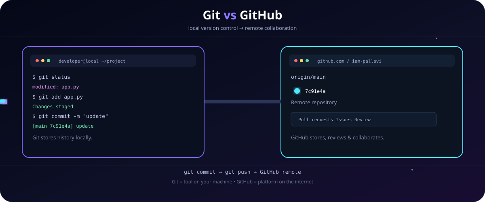
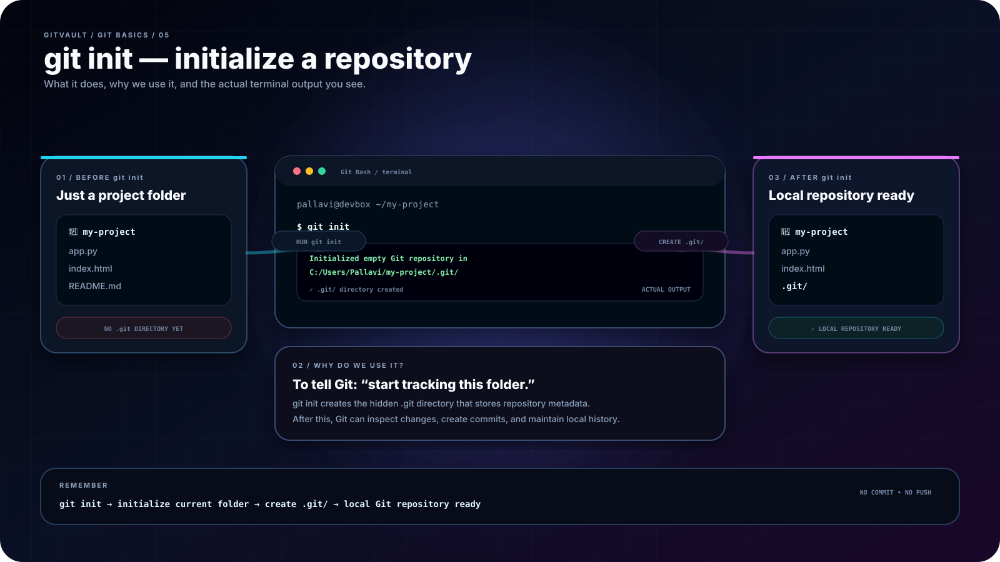
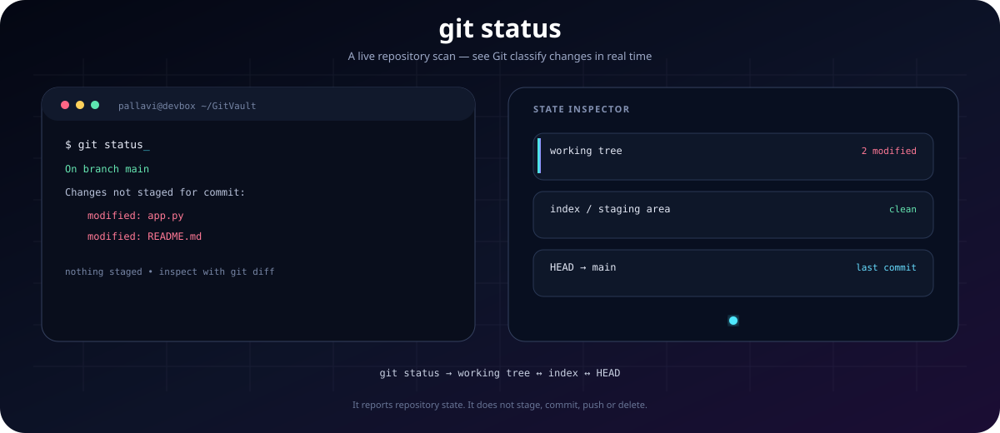
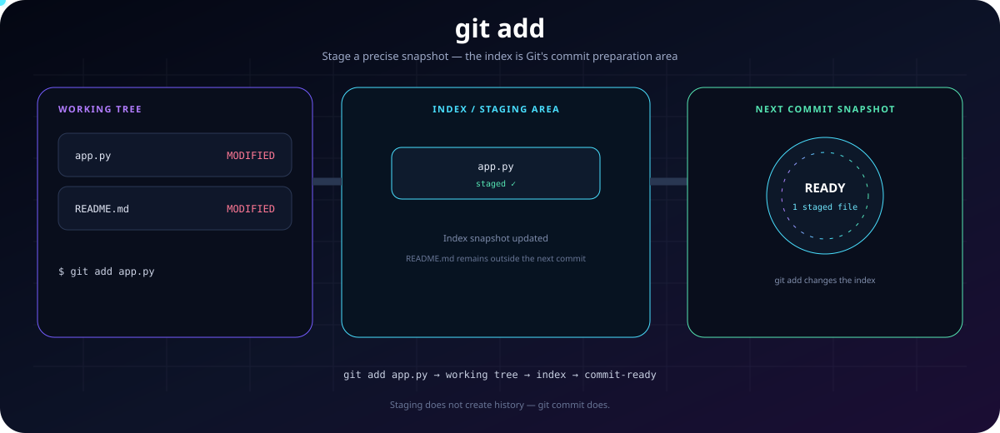
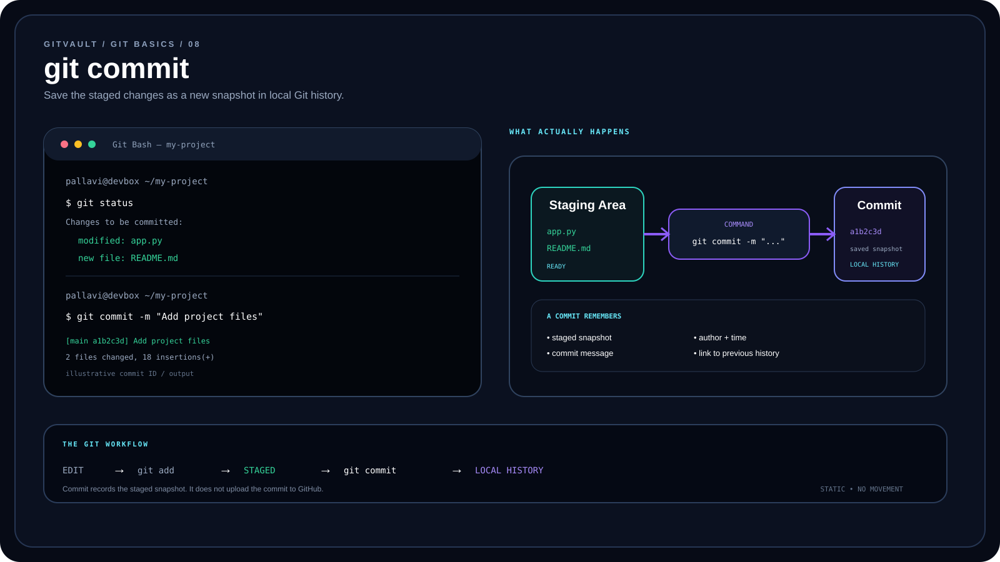
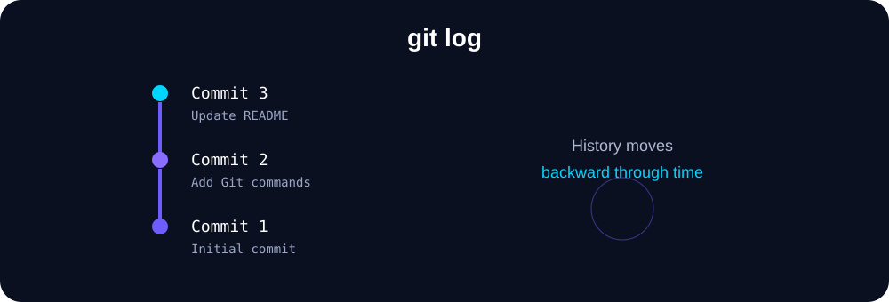
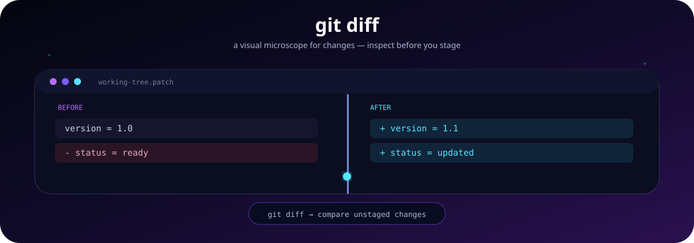
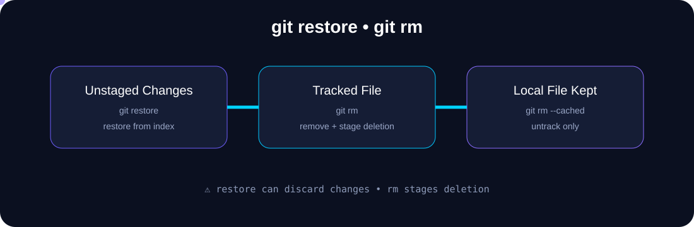

<div align="center">


# Git Basics

### A practical foundation for Git & GitHub

</div>

---

## 📌 What This Section Covers

This section contains my practical notes for the **core Git concepts and commands** I am learning before moving to branches, merge, rebase, undo, internals, and GitHub workflows.

### ⚡ Git Workflow — See How Changes Move



> The glowing flow represents how changes move through the Git workflow: **check → stage → commit → push**.

### Learning Path

```text
Git Introduction
      ↓
Git vs GitHub
      ↓
Git Configuration
      ↓
git init
      ↓
git status
      ↓
git add
      ↓
git commit
      ↓
git log
      ↓
git diff
      ↓
git restore / git rm
      ↓
Basic Git Workflow
      ↓
Hands-on Practice
```

---

## 1. 🧠 Git Introduction

### What is Git?

**Git is a distributed version control system (VCS)** used to track changes in files and maintain the history of a project.

With Git, I can:

- Track changes made to files
- See what changed and when
- Save different versions of my work
- Create branches for separate work
- Go back to earlier versions when needed
- Work with other developers

### Why do we use Git?

Without version control, managing multiple changes manually can become difficult. Git gives the project a structured history and makes changes easier to track and manage.

---

## 2. 🔄 Git vs GitHub



| Git | GitHub |
|---|---|
| Version control system | Cloud-based Git hosting platform |
| Runs locally on your computer | Used through the internet |
| Tracks project history | Hosts and shares Git repositories |
| Commands like `git add`, `git commit` | Provides collaboration, pull requests, issues, etc. |
| Does not require GitHub | Uses Git repositories for collaboration |

> **Simple way to remember:** Git manages version history. GitHub helps store and collaborate on Git repositories online.

---

## 3. ⚙️ Git Installation / Verification

If Git is already installed, I can verify it with:

```bash
git --version
```

Example output:

```text
git version 2.x.x
```

---

## 4. 🔧 Git Configuration

Before creating commits, Git should know the identity that will be associated with those commits.

### Set username

```bash
git config --global user.name "Your Name"
```

### Set email

```bash
git config --global user.email "your-email@example.com"
```

### View all global settings

```bash
git config --global --list
```

### Check username

```bash
git config --global user.name
```

### Check email

```bash
git config --global user.email
```

`--global` means the configuration applies to Git repositories for the current user on the computer.

> **Note:** Git configuration identifies the author of commits. It is separate from GitHub authentication.

---

## 5. 📦 Initialize a Repository — `git init`

`git init` initializes the current directory as a Git repository.

```bash
git init
```

Git creates a hidden `.git` directory that stores repository metadata and history.

### Visual



> `git init` creates a local repository. It does **not** automatically connect the project to GitHub.

---

## 6. 🔍 Check Repository Status — `git status`

`git status` shows the current state of the working tree and staging area.

```bash
git status
```

It can show information such as:

- Current branch
- Modified files
- Untracked files
- Staged changes
- Changes that are not yet staged

### Visual



`git status` is one of the safest and most useful commands to run frequently.

---

## 7. ➕ Stage Changes — `git add`

`git add` moves changes from the working directory into the **staging area** so they can be included in the next commit.

### Add one file

```bash
git add index.html
```

### Add changes under the current directory

```bash
git add .
```

### Visual



> Staging lets me choose which changes should be included in the next commit.

---

## 8. 💾 Commit Changes — `git commit`

`git commit` records the staged changes as a new snapshot in the local Git repository.

```bash
git commit -m "Add index.html"
```

A good commit message should briefly describe what was changed.

### Visual



---

## 9. 📜 View Commit History — `git log`

`git log` displays the commit history of a repository.

```bash
git log
```

For a compact history:

```bash
git log --oneline
```

### Visual



The history helps me understand how the project changed over time.

---

## 10. 🔎 View Changes — `git diff`

`git diff` shows the differences between the working tree and the staging area for unstaged changes.

```bash
git diff
```

Common symbols:

```text
+ Added line
- Removed line
```

### Visual



For staged changes, a commonly used form is:

```bash
git diff --staged
```

> Deeper Git diff concepts and comparison techniques will be covered separately in **06-Git-Diff**.

---

## 11. ↩️ Discard Unstaged Changes — `git restore`

`git restore` can be used to discard unstaged changes in a tracked file and restore it from the index.

```bash
git restore README.md
```

### Visual



⚠️ **Be careful:** discarded changes may not be easily recoverable.

---

## 12. 🗑️ Remove Files — `git rm`

`git rm` removes a file from the working tree and stages that deletion.

```bash
git rm test.txt
git commit -m "Remove test file"
```

### Remove from Git tracking but keep the local file

```bash
git rm --cached filename
```

### Difference

| Command | Result |
|---|---|
| `git rm file.txt` | Removes the file and stages the deletion |
| `git rm --cached file.txt` | Removes the file from Git tracking but keeps it locally |

---

## 13. 🔁 Basic Git Workflow

The basic workflow I want to remember is:


### 🧠 Easy Memory Trick

**Check → Review → Stage → Commit → History**

---

## 14. 🧪 Hands-on Practice

The best way to learn Git is to perform the complete cycle on a small practice folder.

### Step 1 — Create a practice folder

```bash
mkdir git-practice
cd git-practice
```

### Step 2 — Initialize Git

```bash
git init
```

### Step 3 — Create a file

```bash
echo "Hello Git" > hello.txt
```

### Step 4 — Check the status

```bash
git status
```

### Step 5 — Stage the file

```bash
git add hello.txt
```

### Step 6 — Check the status again

```bash
git status
```

The file should now appear under **Changes to be committed**.

### Step 7 — Commit the change

```bash
git commit -m "Add hello.txt"
```

### Step 8 — View the history

```bash
git log --oneline
```

### Step 9 — Modify the file

```bash
echo "Learning Git step by step" >> hello.txt
```

### Step 10 — Inspect the change

```bash
git diff
```

### Step 11 — Stage and commit again

```bash
git add hello.txt
git commit -m "Update hello.txt"
```

### Step 12 — Check the history

```bash
git log --oneline
```

### 🎯 Practice Goal

After completing this exercise, I should be able to explain:


---

## 15. 📝 Practice / Interview Q&A

### Q1. What is Git?

Git is a distributed version control system used to track changes and maintain project history.

### Q2. What is the difference between Git and GitHub?

Git is the version control system. GitHub is an online platform for hosting Git repositories and collaborating on them.

### Q3. What does `git init` do?

It initializes the current directory as a Git repository and creates the `.git` directory.

### Q4. What does `git status` show?

It shows the current state of the working tree and staging area, including untracked, modified, and staged files.

### Q5. What is the difference between `git add` and `git commit`?

`git add` stages changes. `git commit` records the staged changes in the repository history.

### Q6. What does `git log` do?

It displays the commit history of the repository.

### Q7. What does `git diff` do?

It shows the differences between the working tree and the staging area for unstaged changes.

### Q8. What does `git restore` do?

It can discard unstaged changes in a tracked file and restore the file from the index.

### Q9. What is the difference between `git rm` and `git rm --cached`?

`git rm` removes the file and stages its deletion. `git rm --cached` removes it from Git tracking while keeping the file in the working directory.

### Q10. What is the basic Git workflow?

```text
Modify → Check → Review → Stage → Commit → Check History
```

---

## ✅ Git Basics Completion Checklist

- [x] Understand what Git is
- [x] Understand Git vs GitHub
- [x] Verify Git installation
- [x] Configure Git identity
- [x] Initialize a repository with `git init`
- [x] Check repository state with `git status`
- [x] Stage changes with `git add`
- [x] Create commits with `git commit`
- [x] View history with `git log`
- [x] Inspect changes with `git diff`
- [x] Discard unstaged changes with `git restore`
- [x] Remove files with `git rm`
- [x] Understand the basic Git workflow
- [x] Practice the complete local Git cycle

> **Folder status: 🟢 Git Basics complete**

---

<div align="center">

### Keep learning. Keep committing. 🚀

**GitVault — Learn Git by understanding and practicing.**

</div>
