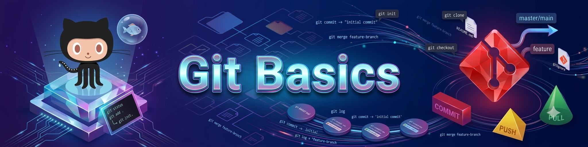
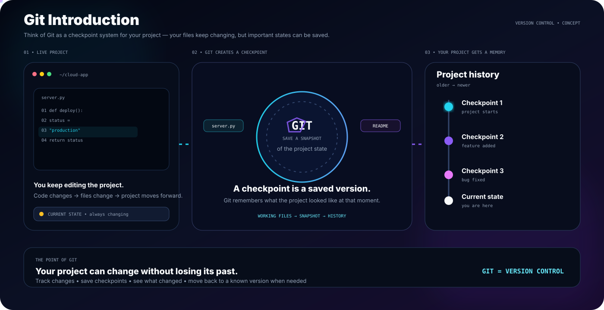
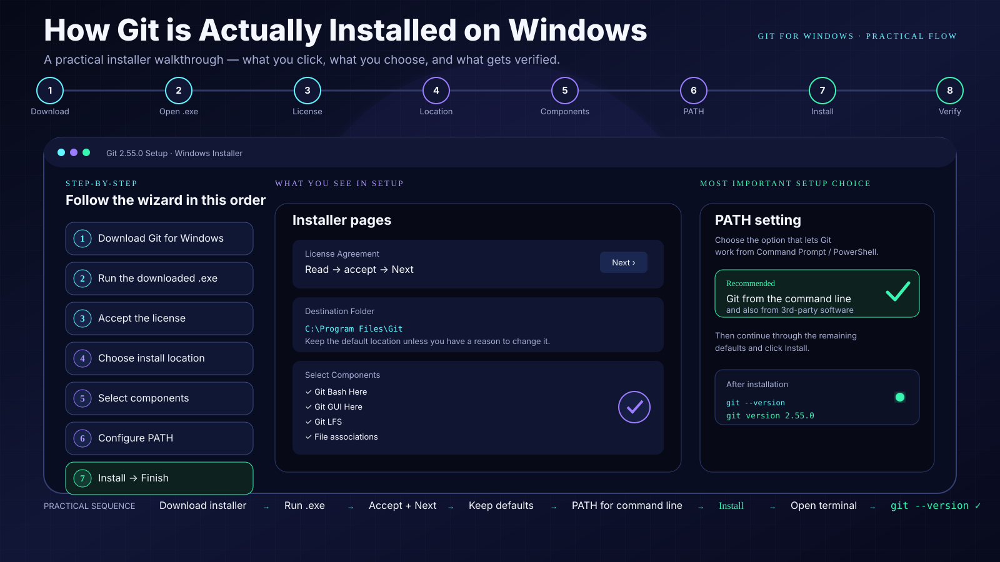
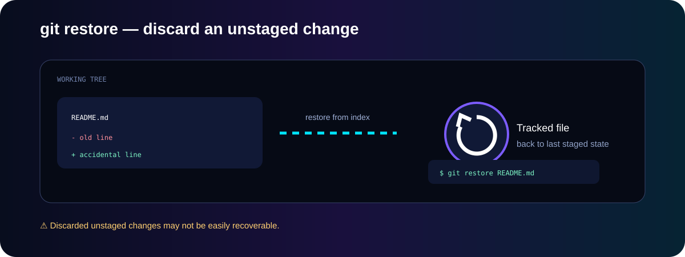
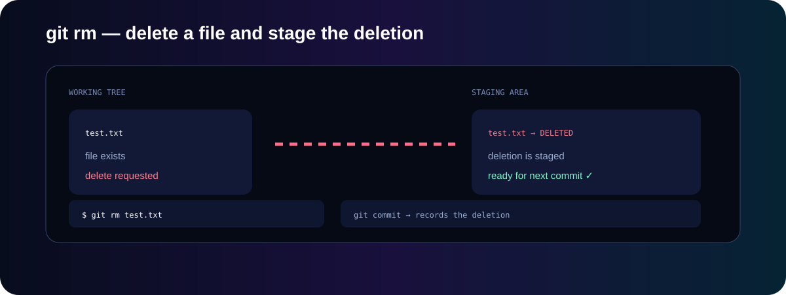

<div align="center">


# Git Basics

### A practical foundation for Git & GitHub

</div>

---

## 📌 What This Section Covers

This section contains my practical notes for the **core Git concepts and commands** I am learning before moving to branches, merge, rebase, undo, internals, and GitHub workflows.

### Learning Path

```text
Git Introduction → Git vs GitHub → Git Installation → Git Configuration → git init → git status → git add → git commit → git log → git diff → git restore / git rm → Basic Git Workflow → Hands-on Practice
```

---

## 1. 🧠 Git Introduction

### What is Git?

**Git is a distributed version control system (VCS)** used to track changes in files and maintain the history of a project.

With Git, I can:
- Track changes made to files
- See what changed and when
- Save different versions of my work
- Create branches for separate work
- Go back to earlier versions when needed
- Work with other developers

<div align="center">

</div>

---

## 2. 🔄 Git vs GitHub

<div align="center">

</div>

| Git | GitHub |
|---|---|
| Version control system | Cloud-based Git hosting platform |
| Runs locally on your computer | Used through the internet |
| Tracks project history | Hosts and shares Git repositories |
| Uses commands like `git add`, `git commit` | Provides collaboration, pull requests, issues, etc. |

---

## 3. ⚙️ Git Installation / Verification

Git needs to be installed before Git commands can be used from the terminal.

<div align="center">

</div>

```bash
git --version
```

---

## 4. 🔧 Git Configuration

Before creating commits, Git should know the identity associated with those commits.

<div align="center">

</div>

```bash
git config --global user.name "Your Name"
git config --global user.email "your-email@example.com"
git config --global --list
```

---

## 5. 📦 Initialize a Repository — `git init`

`git init` initializes the current directory as a Git repository.

<div align="center">

</div>

```bash
git init
```

Git creates the hidden `.git` directory containing repository metadata. It does not automatically connect the project to GitHub.

---

## 6. 🔍 Check Repository Status — `git status`

`git status` shows the current state of the working tree and staging area.

<div align="center">

</div>

```bash
git status
```

---

## 7. ➕ Stage Changes — `git add`

`git add` stages the current version of selected changes so they can be included in the **next commit**.

<div align="center">

</div>

### Actual command

<div align="center"><code><strong>git add app.py</strong></code></div>

`git add .` can stage all changes under the current directory.

> `git add` normally produces no success message. Run `git status` to verify that the file is staged.

---

## 8. 💾 Create a Snapshot — `git commit`

`git commit` records the staged changes as a new snapshot in the local Git repository.

<div align="center">

</div>

### Actual command

<div align="center"><code><strong>git commit -m "Add project files"</strong></code></div>

A commit saves the staged snapshot locally. It does not upload the commit to GitHub.

---

## 9. 📜 View Commit History — `git log`

`git log` displays the commit history, with the newest commit first.

<div align="center">

</div>

### ⚡ Main Command

<div align="center"><code><strong>git log</strong></code></div>

### ⚡ Quick History Command

<div align="center"><code><strong>git log --oneline</strong></code></div>

Example:

```text
a1b2c3d Add project files
7f8e9d1 Initial project setup
```

> `git log` only displays existing history. It does not create, modify, or upload commits.

---

## 10. 🔎 View Changes — `git diff`

`git diff` shows differences between the working tree and staging area for unstaged changes.

<div align="center">

</div>

### ⚡ Main Command

<div align="center"><code><strong>git diff</strong></code></div>

For staged changes:

<div align="center"><code><strong>git diff --staged</strong></code></div>

---

## 11. ↩️ Discard Unstaged Changes — `git restore`

`git restore` can discard unstaged changes in a tracked file and restore the file from the index.

<div align="center">

</div>

### ⚡ Main Command

<div align="center"><code><strong>git restore README.md</strong></code></div>

⚠️ This can discard local unstaged changes.

---

## 12. 🗑️ Remove Files — `git rm`

`git rm` removes a tracked file from the working tree and stages the deletion.

<div align="center">

</div>

### ⚡ Main Commands

<div align="center"><code><strong>git rm test.txt</strong></code></div>

<div align="center"><code><strong>git rm --cached filename</strong></code></div>

`git rm --cached` removes the file from Git tracking but keeps the local file.

---

## 13. 🔁 Basic Git Workflow

The basic workflow is:

<div align="center">

</div>

### ⚡ Complete Workflow

<div align="center"><code><strong>git status → git add → git commit → git push</strong></code></div>

```text
Working Directory
       ↓
   git status
       ↓
    git add
       ↓
  Staging Area
       ↓
   git commit
       ↓
 Local Repository
       ↓
    git push
       ↓
     GitHub
```

### 🧠 Easy Memory Trick

**Edit → Check → Stage → Commit → Push**

---

## 14. 🧪 Hands-on Practice

The best way to learn Git is to perform the complete cycle on a small practice folder.

### Step 1 — Create a practice folder

```bash
mkdir git-practice
cd git-practice
```

### Step 2 — Initialize Git

```bash
git init
```

### Step 3 — Create a file

```bash
echo "Hello Git" > hello.txt
```

### Step 4 — Check the status

```bash
git status
```

### Step 5 — Stage the file

```bash
git add hello.txt
```

### Step 6 — Check the status again

```bash
git status
```

The file should now appear under **Changes to be committed**.

### Step 7 — Commit the change

```bash
git commit -m "Add hello.txt"
```

### Step 8 — View the history

```bash
git log --oneline
```

---

## 15. 📝 Practice / Interview Q&A

### Q1. What is Git?

Git is a distributed version control system used to track changes and maintain project history.

### Q2. What is the difference between Git and GitHub?

Git is the version control system. GitHub is an online platform for hosting Git repositories and collaborating on them.

### Q3. What does `git init` do?

It initializes the current directory as a Git repository and creates the `.git` directory.

### Q4. What does `git status` show?

It shows the current state of the working tree and staging area, including untracked, modified, and staged files.

### Q5. What is the difference between `git add` and `git commit`?

`git add` stages changes. `git commit` records the staged changes in repository history.

### Q6. What does `git log` do?

It displays the commit history of the repository.

### Q7. What does `git diff` do?

It shows differences between the working tree and staging area for unstaged changes.

### Q8. What does `git restore` do?

It can discard unstaged changes in a tracked file and restore the file from the index.

### Q9. What is the difference between `git rm` and `git rm --cached`?

`git rm` removes the file and stages its deletion. `git rm --cached` removes the file from Git tracking while keeping it locally.

### Q10. What is the basic Git workflow?

```text
Edit → Check → Stage → Commit → Push
```

---

## ✅ Git Basics Completion Checklist

- [x] Understand what Git is
- [x] Understand Git vs GitHub
- [x] Verify Git installation
- [x] Configure Git identity
- [x] Initialize a repository with `git init`
- [x] Check repository state with `git status`
- [x] Stage changes with `git add`
- [x] Create commits with `git commit`
- [x] View history with `git log`
- [x] Inspect changes with `git diff`
- [x] Discard unstaged changes with `git restore`
- [x] Remove files with `git rm`
- [x] Understand the basic Git workflow
- [ ] Practice the complete local Git cycle

> **Folder status: 🟡 In progress — core Git commands covered**

---

<div align="center">

### Keep learning. Keep committing. 🚀

**GitVault — Learn Git by understanding and practicing.**

</div>
