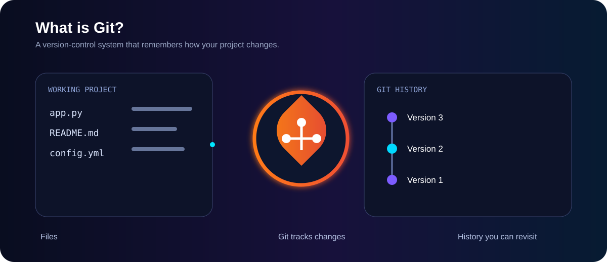

<div align="center">

# Git Basics — Animated Visual Guide

### See what Git is doing, not just what the command means.

</div>

> Every core topic in **01-Git-Basics** now has a dedicated animated SVG that visually explains the flow behind the command/concept.

---

## 1. Git Introduction



**How it works:** Your working files change → Git tracks those changes → Git creates versions/snapshots → you can revisit project history.

---

## 2. Git vs GitHub


**How it works:** Git manages version history locally. GitHub hosts the Git repository online and adds collaboration features such as pull requests, issues and code review.

---

## 3. Git Installation / Verification



**How it works:** `git --version` asks the system for the installed Git version. If a version is returned, Git is available in the terminal.

---

## 4. Git Configuration


**How it works:** Git stores your configured name and email and uses that identity as the author information attached to your commits.

---

## 5. `git init`


**How it works:** `git init` turns a normal project directory into a local Git repository by creating the hidden `.git` directory that stores repository metadata.

---

## 6. `git status`


**How it works:** Git compares the working tree and staging area with the current repository state and tells you which files are untracked, modified or staged.

---

## 7. `git add`


**How it works:** `git add` moves selected changes from the working tree into the staging area. The staged snapshot is what the next commit will record.

---

## 8. `git commit`


**How it works:** Git takes the staged snapshot, creates a commit in local history, gives it a commit ID, and records the commit message and author information.

---

## 9. `git log`


**How it works:** `git log` walks through the commit history so you can see the current commit, previous commits and their messages/IDs.

---

## 10. `git diff`


**How it works:** Git compares two states and highlights exactly what was added and removed. `git diff` is useful for reviewing unstaged changes before staging them.

---

## 11. `git restore`


**How it works:** `git restore file.txt` can replace an unstaged working-tree version with the version from the index, discarding the unstaged change.

---

## 12. `git rm`


**How it works:** `git rm file.txt` removes the file from the working tree and stages that deletion so the next commit can record it.

---

## 13. Basic Git Workflow


**How it works:** Modify → check → stage → commit → inspect history → push to GitHub. Each stage has a specific purpose and Git keeps the local history as a sequence of commits.

---

## 🧠 The whole folder in one picture

```text
                 YOUR PROJECT
                      │
                      ▼
              ┌───────────────┐
              │ Working Tree  │
              └───────┬───────┘
                      │ git add
                      ▼
              ┌───────────────┐
              │ Staging Area  │
              └───────┬───────┘
                      │ git commit
                      ▼
              ┌───────────────┐
              │ Local History │
              └───────┬───────┘
                      │ git push
                      ▼
              ┌───────────────┐
              │    GitHub     │
              └───────────────┘
```

### Learning rule

**Don't memorize only the command. Understand what changes inside Git after the command runs.**

<div align="center">

### Git Basics → Understand → Visualize → Practice → Explain 🚀

</div>
