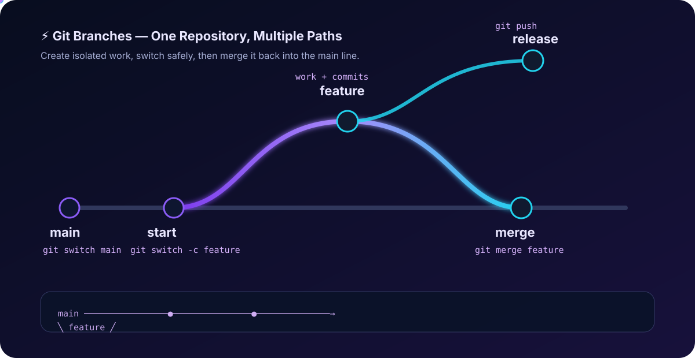

<div align="center">



# Git Branches

**Branches let you work on features independently without disturbing the main code line.**

</div>

## 🌿 What is a Git Branch?

A branch is an independent line of development in the same Git repository.

Think of it like this:

```text
main ─────────────●──────────────●──────────────●────→
                  \
                   ●────●────●   feature/login
                                  \
                                   └── merge → main
```

The `main` branch remains stable while you develop a feature on a separate branch.

## 🧠 Why Do We Use Branches?

- Develop features safely
- Fix bugs without disturbing `main`
- Work on multiple tasks at the same time
- Review changes before merging
- Keep production-ready code stable

## 🔑 Important Commands

### Create a branch

```bash
git branch feature-login
```

### See all branches

```bash
git branch
```

The `*` shows the branch you are currently on.

### Switch to a branch

```bash
git switch feature-login
```

### Create + switch in one command

```bash
git switch -c feature-login
```

Older equivalent:

```bash
git checkout -b feature-login
```

### Rename the current branch

```bash
git branch -m new-name
```

### Delete a local branch

```bash
git branch -d feature-login
```

Force delete when Git says the branch has unmerged work:

```bash
git branch -D feature-login
```

> ⚠️ `-D` can delete work that has not been merged. Use it carefully.

## 🔄 Basic Branch Workflow

```text
main
  │
  ├── git switch -c feature
  │
  ▼
feature
  │
  ├── make changes
  ├── git add .
  ├── git commit -m "Add feature"
  │
  ▼
main
  │
  └── git merge feature
```

## 🌐 Remote Branches

Push a new local branch to GitHub:

```bash
git push -u origin feature-login
```

After the upstream is configured, later pushes can usually be:

```bash
git push
```

Fetch the latest remote information:

```bash
git fetch origin
```

List remote branches:

```bash
git branch -r
```

## 💡 Example

Suppose you are building a Cloud project and `main` contains the stable version.

```text
main
  │
  ├── feature/docker
  │      └── Dockerfile + changes
  │
  ├── feature/aws
  │      └── AWS configuration
  │
  └── bugfix/login
         └── bug fix
```

Each task can be developed separately and merged into `main` after it is ready.

## 🎯 Interview Questions

**Q1. What is a Git branch?**  
A branch is an independent development line that allows changes to be made separately from another branch.

**Q2. Why should we avoid doing every change directly on `main`?**  
Because `main` is commonly kept stable. Feature branches reduce the risk of unfinished or broken changes reaching it.

**Q3. Difference between `git branch` and `git switch`?**  
`git branch` is commonly used to create, list, rename, or delete branches. `git switch` is used to move between branches and can also create a new branch with `-c`.

**Q4. What does `git switch -c feature` do?**  
It creates a new branch named `feature` and immediately switches to it.

**Q5. What is a remote branch?**  
A branch reference that exists on a remote repository such as GitHub, for example `origin/main`.

## 🧠 Memory Trick

**Create → Switch → Work → Commit → Push → Merge**

```text
branch
  ↓
switch
  ↓
code
  ↓
commit
  ↓
push
  ↓
merge
```
